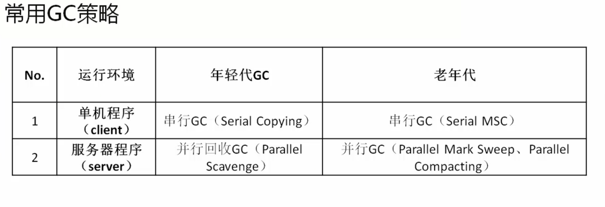

# GC
GC是Garbage Collection（垃圾回收），有关Java垃圾回收的问题，提到垃圾回收肯定要涉及到JVM内存管理机制，Java语言的执行效率一直被C、C++程序员所嘲笑，其实，事实就是这样，Java在执行效率方面确实很低，一方面，Java语言采用面向对象思想，这也决定了其必然是开发效率高，执行效率低。另一方面，Java语言对程序员做了一个美好的承诺：程序员无需去管理内存，因为JVM有垃圾回收（GC），会去自动进行垃圾回收。

# 常见的gc算法
### 标记-清除算法（Mark-Sweep）

最基础的GC算法，将需要进行回收的对象做标记，之后扫描，有标记的进行回收，这样就产生两个步骤：标记和清除。这个算法效率不高，而且在清理完成后会产生内存碎片，这样，如果有大对象需要连续的内存空间时，还需要进行碎片整理，所以，此算法需要改进。

### 复制算法（Copying）

前面我们谈过，新生代内存分为了三份，Eden区和2块Survivor区，一般Sun的JVM会将Eden区和Survivor区的比例调为8:1，保证有一块Survivor区是空闲的，这样，在垃圾回收的时候，将不需要进行回收的对象放在空闲的Survivor区，然后将Eden区和第一块Survivor区进行完全清理，这样有一个问题，就是如果第二块Survivor区的空间不够大怎么办？这个时候，就需要当Survivor区不够用的时候，暂时借持久代的内存用一下。此算法适用于新生代。

### 标记-整理（或叫压缩）算法（Mark-Compact）

和标记-清除算法前半段一样，只是在标记了不需要进行回收的对象后，将标记过的对象移动到一起，使得内存连续，这样，只要将标记边界以外的内存清理就行了。此算法适用于持久代。

# 垃圾回收策略
### 串行GC（SerialGC）
Serial GC。是最基本、最古老的收集器，但是现在依然被广泛使用，是一种单线程垃圾回收机制，而且不仅如此，它最大的特点就是在进行垃圾回收的时候，需要将所有正在执行的线程暂停（Stop The World），对于有些应用这是难以接受的，但是我们可以这样想，只要我们能够做到将它所停顿的时间控制在N个毫秒范围内，大多数应用我们还是可以接受的，而且事实是它并没有让我们失望，几十毫米的停顿我们作为客户机（Client）是完全可以接受的，该收集器适用于单CPU、新生代空间较小及对暂停时间要求不是非常高的应用上，是client级别默认的GC方式，可以通过-XX:+UseSerialGC来强制指定。
### 并行GC（ParNew）
ParNew GC。基本和Serial GC一样，但本质区别是加入了多线程机制，提高了效率，这样它就可以被用在服务器端（Server）上，同时它可以与CMS GC配合，所以，更加有理由将它置于Server端。
### 并行回收GC（Parallel Scavenge）
Parallel Scavenge GC。在整个扫描和复制过程采用多线程的方式来进行，适用于多CPU、对暂停时间要求较短的应用上，是server级别默认采用的GC方式，可用-XX:+UseParallelGC来强制指定，用-XX:ParallelGCThreads=4来指定线程数。以下给出几组使用组合：

